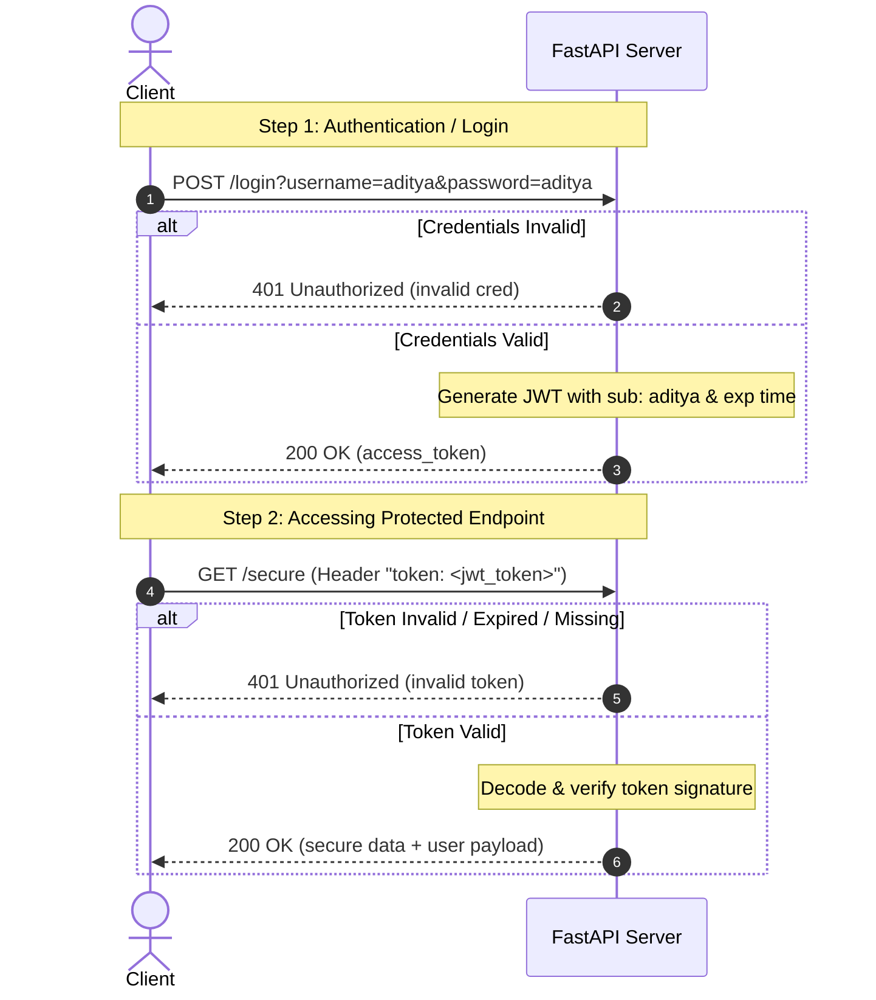

# JWT Authentication with FastAPI

A clean, robust implementation of **JSON Web Token (JWT)** authentication using **FastAPI** and the `python-jose` library. This project demonstrates how to generate, sign, and verify JWT tokens to protect endpoints.

---

## 🔑 Key Features
- **Stateless Authentication**: Uses JWTs signed with `HS256` symmetric encryption.
- **Expiration Protection**: Generated tokens automatically expire after **30 minutes**.
- **Route Protection**: Implements FastAPI's dependency injection (`Depends`) to secure endpoints.
- **Interactive Documentation**: Instantly explore and test the endpoints via Swagger UI.

---

## 🛠️ Architecture & Flow

The authentication flow is illustrated below:



---

## 📂 File Description

This is the core application file. It contains:
1. **Configuration**:
   * `SECRET_KEY`: Used to sign the JWT signature.
   * `ALGORITHM`: Set to `"HS256"`.
2. **`create_token(data: dict)`**:
   * Encodes a payload dictionary into a JWT.
   * Adds an `exp` (expiration) timestamp calculated as UTC `now` + 30 minutes.
3. **`login(username, password)`**:
   * Accepts credentials as query parameters.
   * Compares them against hardcoded values (`aditya` / `aditya`).
   * Generates and returns a JWT if valid.
4. **`varify_token(token)`**:
   * A FastAPI Dependency that reads the token from a custom header named `token`.
   * Decodes and validates the token. Raises a `401 Unauthorized` exception if invalid or expired.
5. **`secure_data(user)`**:
   * A protected route that uses `Depends(varify_token)`.

---

## 🚀 Setup and Run Guide

### 1. Prerequisites
Ensure you have Python 3.9+ installed. The environment `env` in this directory is already configured.

### 2. Activate the Virtual Environment
Activate your existing virtual environment depending on your operating system:

**On Linux/macOS:**
```bash
source env/bin/activate
```

**On Windows (Command Prompt):**
```cmd
env\Scripts\activate.bat
```

**On Windows (PowerShell):**
```powershell
.\env\Scripts\Activate.ps1
```

### 3. Install Dependencies
If not already installed, run:
```bash
pip install fastapi uvicorn python-jose
```

### 4. Run the Uvicorn Server
Start the development server with auto-reload enabled:
```bash
uvicorn main:app --reload
```
* **`main`**: The python file (`main.py`).
* **`app`**: The FastAPI instance created in `main.py` (`app = FastAPI()`).
* **`--reload`**: Restarts the server automatically when code changes are detected.

---

## 🧪 Testing the API

### Method A: Interactive API Docs (Recommended)
1. Open [http://127.0.0.1:8000/docs](http://127.0.0.1:8000/docs) in your browser.
2. Expand the `POST /login` route, click **Try it out**, enter `aditya` for both username and password, and click **Execute**.
3. Copy the returned `access_token` from the response body.
4. Expand the `GET /secure` route, click **Try it out**, paste the token into the `token` header parameter, and click **Execute**.

### Method B: Testing with `curl`

**1. Login & Generate Token:**
```bash
curl -X 'POST' \
  'http://127.0.0.1:8000/login?username=aditya&password=aditya' \
  -H 'accept: application/json'
```
**Response:**
```json
{
  "access_token": "eyJhbGciOiJIUzI1NiIsInR5cCI6IkpXVCJ9..."
}
```

**2. Access Protected Route (Valid Token):**
```bash
curl -X 'GET' \
  'http://127.0.0.1:8000/secure' \
  -H 'accept: application/json' \
  -H 'token: eyJhbGciOiJIUzI1NiIsInR5cCI6IkpXVCJ9...'
```
**Response:**
```json
{
  "message": "this is secure data",
  "user": {
    "sub": "aditya",
    "exp": 1782489600
  }
}
```

**3. Access Protected Route (Without/Invalid Token):**
```bash
curl -X 'GET' \
  'http://127.0.0.1:8000/secure' \
  -H 'accept: application/json' \
  -H 'token: invalid_token_here'
```
**Response:**
```json
{
  "detail": "invalid token"
}
```
