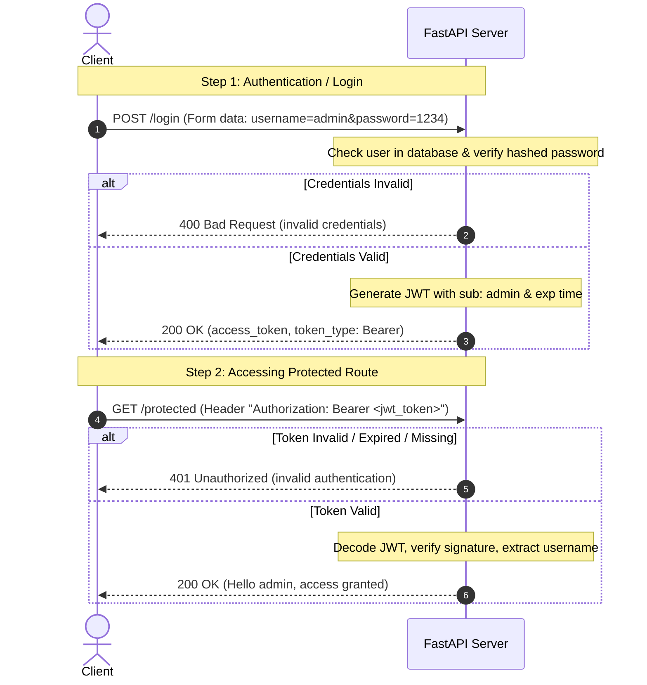

# JWT Authentication with FastAPI (Day 22)

A production-level implementation of **JSON Web Token (JWT)** authentication using **FastAPI**, **OAuth2**, and secure password hashing with `passlib` (using `bcrypt`).

---

## 🔑 Key Features
- **OAuth2 Password Flow**: Built-in support for the standard OAuth2 Password flow with `OAuth2PasswordBearer` and `OAuth2PasswordRequestForm`.
- **Secure Password Hashing**: Passwords stored in the database are salted and hashed using `bcrypt` to prevent plain-text leaks.
- **Stateless Authentication**: Uses self-contained JWT access tokens signed with a symmetric secret key (`HS256`).
- **Access Expiration**: Generated tokens automatically expire after **30 minutes**.
- **Interactive Documentation**: Easily authorize and test API endpoints directly inside the Swagger UI.

---

## 🛠️ Architecture & Flow

The authentication flow is illustrated below:



---

## 📂 File Structure & Key Components

### [main.py](file:///home/aditya/Desktop/Fast%20API/day%2022/main.py)
This is the core application file containing all the logic:
1. **Password Hashing Setup**:
   * Uses `CryptContext(schemes=["bcrypt"], deprecated="auto")` to securely hash and verify passwords.
2. **FastAPI OAuth2 Integration**:
   * `OAuth2PasswordBearer(tokenUrl="login")` tells FastAPI the endpoint to obtain token is `login`.
   * Integrates a dummy database (`fake_users_db`) mapping username `admin` to a secure `hashed_password`.
3. **`create_token(data: dict)`**:
   * Encodes a payload dictionary into a JWT.
   * Adds an `exp` (expiration) timestamp calculated as UTC `now` + 30 minutes.
4. **`login(form_data)`**:
   * Expects standard URL-encoded form data (`username` and `password`).
   * Validates credentials against `fake_users_db`.
   * Returns a standard OAuth2-compliant JSON structure: `{"access_token": "...", "token_type": "bearer"}`.
5. **`verify_token(token)`**:
   * A FastAPI Dependency that retrieves the token from the standard `Authorization` header.
   * Decodes and validates the token signature and expiration.
6. **`protected_route(username)`**:
   * A protected route that uses `Depends(verify_token)`.

---

## 🚀 Setup and Run Guide

### 1. Prerequisites
Ensure you have Python 3.9+ installed. The environment `env` in this directory is already configured.

### 2. Activate the Virtual Environment
Activate your existing virtual environment depending on your operating system:

**On Linux/macOS:**
```bash
source env/bin/activate
```

**On Windows (Command Prompt):**
```cmd
env\Scripts\activate.bat
```

**On Windows (PowerShell):**
```powershell
.\env\Scripts\Activate.ps1
```

### 3. Install Dependencies
Ensure you have the required packages installed in your environment:
```bash
pip install fastapi uvicorn python-jose[cryptography] passlib[bcrypt] "bcrypt<4.1.0" python-multipart
```
> [!NOTE]
> `bcrypt` is pinned to `<4.1.0` (such as `4.0.1`) to ensure compatibility with `passlib`.
> `python-multipart` is required by FastAPI to parse OAuth2 form logins.

### 4. Run the Uvicorn Server
Start the development server with auto-reload enabled:
```bash
uvicorn main:app --reload
```
* **`main`**: The python file (`main.py`).
* **`app`**: The FastAPI instance created in `main.py` (`app = FastAPI()`).
* **`--reload`**: Restarts the server automatically when code changes are detected.

---

## 🧪 Testing the API

### Method A: Interactive API Docs (Recommended)
1. Open [http://127.0.0.1:8000/docs](http://127.0.0.1:8000/docs) in your browser.
2. Click the green **Authorize** button at the top right.
3. Enter `admin` for Username and `1234` for Password. Click **Authorize** then click **Close**.
4. Now expand the `GET /protected` endpoint, click **Try it out**, and click **Execute**.
5. The API documentation automatically sends the retrieved token in the `Authorization: Bearer <token>` header!

### Method B: Testing with `curl`

**1. Login & Generate Token:**
```bash
curl -X 'POST' \
  'http://127.0.0.1:8000/login' \
  -H 'accept: application/json' \
  -H 'Content-Type: application/x-www-form-urlencoded' \
  -d 'username=admin&password=1234'
```
**Response:**
```json
{
  "access_token": "eyJhbGciOiJIUzI1NiIsInR5cCI6IkpXVCJ9...",
  "token_type": "Bearer"
}
```

**2. Access Protected Route (Valid Token):**
```bash
curl -X 'GET' \
  'http://127.0.0.1:8000/protected' \
  -H 'accept: application/json' \
  -H 'Authorization: Bearer <paste_access_token_here>'
```
**Response:**
```json
{
  "message": "Hello admin, you have access to protected data!",
  "user": "admin"
}
```

**3. Access Protected Route (Without/Invalid Token):**
```bash
curl -X 'GET' \
  'http://127.0.0.1:8000/protected' \
  -H 'accept: application/json' \
  -H 'Authorization: Bearer invalid_token'
```
**Response:**
```json
{
  "detail": "invalid authentication"
}
```
